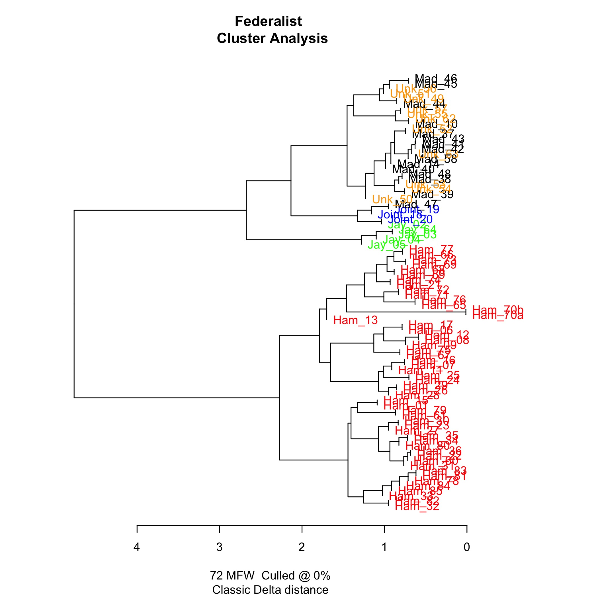
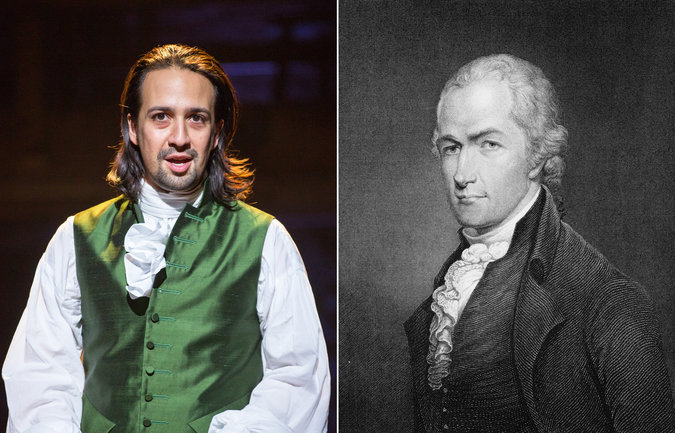

# Federalist

Alexander Hamilton is having a very good year. He’s the star of his
own hit Broadway musical, and he (along with James Madison) is going
to be the star of our last assignment.

As is the case with most real-world Digital Humanities projects,
collaboration and cooperation will be essential for Assignment 8.
It will therefore be conducted almost entirely as an in-class
activity. There is not an individual deliverable. You will instead
be evaluated on your contribution to the group effort. Due in class
Thursday, April 28.

Our goal will be to reproduce the results of Mosteller and Wallace
(1964), who used computational statistical techniques to confirm
Adair’s (1944) authorship attribution for disputed numbers of The
Federalist Papers. We will be using R, RStudio Desktop, and the
stylo R package to analyze the text of The Federalist Papers available
here from Project Gutenberg.

